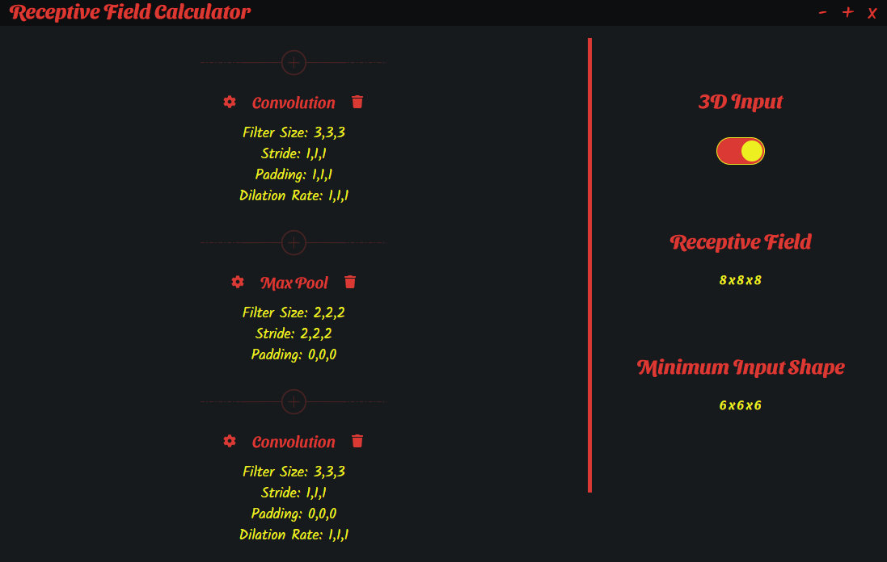
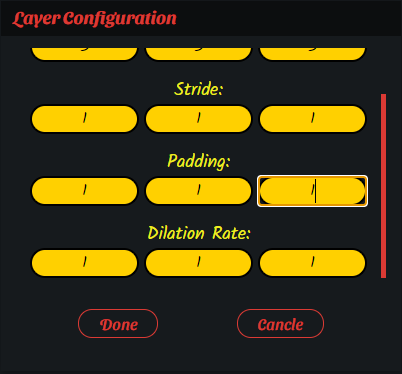

# Receptive Field Calculator
Have you ever got frustrated because of the complicated calculations of Receptive Fields for Convolutional Neural Networks? Here is the tool you need. Receptive Field Calculator is a GUI based calculator which is able to calculate the receptive field and minimum input image size based on the settings of Convolution and Pooling layers of your model for you.

Using receptive field calculator is extremely easy. Just add convolution and pooling layers of your model into this GUI and this tool calculates the receptive field and minimum input image size for you. This tool supports both 2D and 3D layers (for 2D and 3D images respectively).

Receptive Field Calculator is written in JavaScript with the help of Electron.js framework.

## Some Screenshots of The Envirnoment
I provide some screenshot of the environment of the Receptive Field Calculator. These examples are just to show you how the GUI looks like, and the settings used in these examples might be useless.

### Main Window

  

### Configuration

  

